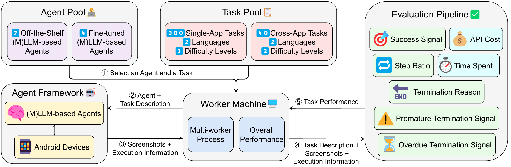

# 🌿🪑 SPA-Bench: A Comprehensive Benchmark for Smartphone Agent Evaluation

<p align="center">
<a href="https://ai-agents-2030.github.io/SPA-Bench/" style="font-size:20px;">Website</a> •
<a href="https://arxiv.org/abs/2410.15164" style="font-size:20px;">Paper</a>
</p>

👋 Welcome to the **SPA-Bench** repository, a benchmark designed to evaluate the performance of smartphone agents. This project offers a structured approach to assessing the efficiency, robustness, and accuracy of various smartphone agents across a variety of scenarios and conditions.

## 📢 News
* [11 Feb '25] SPA-Bench has been accepted to ICLR 2025 and selected as a Spotlight! Congrats to all co-authors🎉 See you in Singapore🇸🇬
* [02 Dec '24] We have partially released the core code, including AppAgent integration. The full version will be made available later this month. Stay tuned for updates!
* [11 Oct '24] SPA-Bench has been accepted by the NeurIPS 2024 Workshop Open-World Agents!

## ⏩ Quick Start
### 🛠️ Installation
```sh
git clone --recurse-submodules https://github.com/ai-agents-2030/SPA-Bench.git
```
### 📜 [Documentation](https://github.com/ai-agents-2030/SPA-Bench/blob/main/Documentation.md)

## 💡 About SPA-Bench

**SPA-Bench** provides a thorough evaluation framework for smartphone agents, covering key metrics and test scenarios that reflect real-world usage patterns and challenges. This benchmark supplies essential tools and datasets to support consistent evaluation of agent performance across a wide range of tasks and applications.



## 💬 Core Features

### 📋 Diverse and Realistic Task Design
* **📦 340 Tasks** - 300 Single-app Tasks and 40 Cross-app Tasks
* **🌐 66 Apps** – 52 Third-party Apps, 7 Google Apps and 7 System Apps
* **🌍 2 Languages** – Chinese and English apps
* **📊 Increased Difficulty Levels**
* **🎨 Human-Annotated Trajectories & Key Components**

### 🤖 Plug-and-Play Agent Framework
* **🧠 11 Smartphone Agents** Ready for Evaluation
* **🧩 Easy Integration** of Your Own Agents with Minimal Code Changes
* **📱 Scalable Design** – Multi-device support & Emulator Compatibility
* **📸 Android Snapshot** – Local Environment Setup and Data Reset for Consistent Testing

### ✅ Automatic and Scalable Evaluation Pipeline
* **🔍 7 Evaluation Metrics** for a Comprehensive Analysis
* **📐 Coarse-and-Fine Success Detection** – Requires No Further Human Effort
* **🔀 Trajectory Splitting & Subtask Evaluation** – Tailored for Long-Sequence Tasks
* **🏆 Performance Metrics**:
  * Single-app Tasks – F1-scores: **0.926 (English)**, **0.884 (Chinese)**
  * Cross-app Tasks – F1-scores: **0.833 (English)**, **0.857 (Chinese)**

## 🚀 Coming Soon
- [ ] Full Agent Integrations
- [ ] Snapshot for Android Emulator
- [x] Task Collection
- [x] Agent Framework
- [x] Evaluation Pipeline

## 🙌 Citation
```bib
@inproceedings{chen2025spabench,
  title={SPA-Bench: A Comprehensive Benchmark for SmartPhone Agent Evaluation},
  author={Jingxuan Chen and Derek Yuen and Bin Xie and Yuhao Yang and Gongwei Chen and Zhihao Wu and Li Yixing and Xurui Zhou and Weiwen Liu and Shuai Wang and Kaiwen Zhou and Rui Shao and Liqiang Nie and Yasheng Wang and Jianye HAO and Jun Wang and Kun Shao},
  booktitle={The Thirteenth International Conference on Learning Representations},
  year={2025},
}
```
